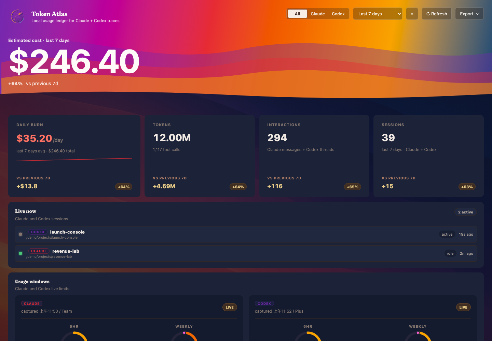
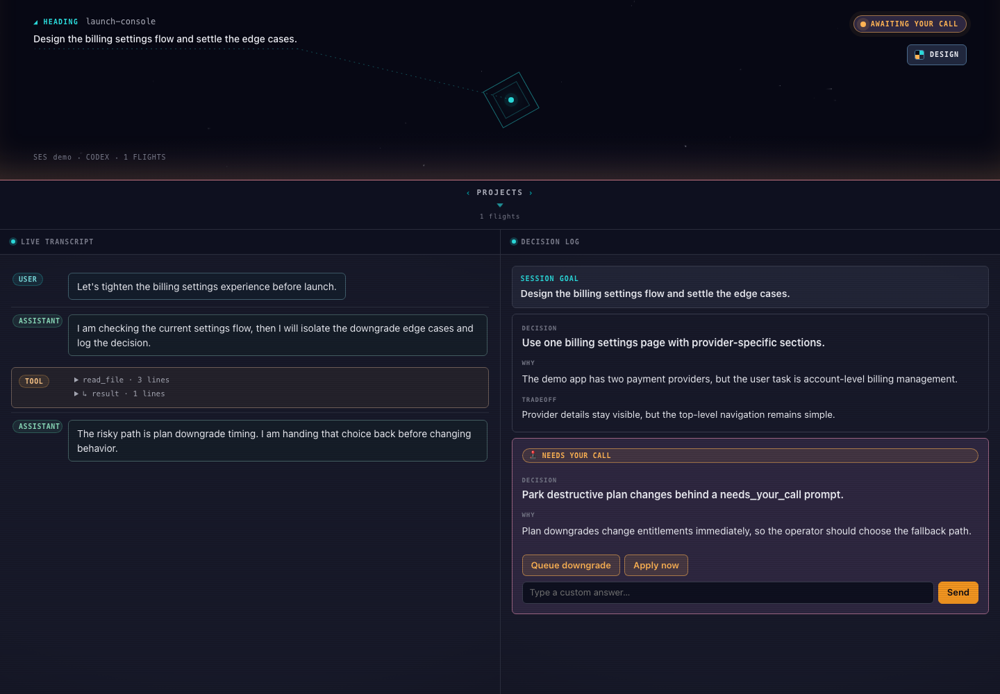
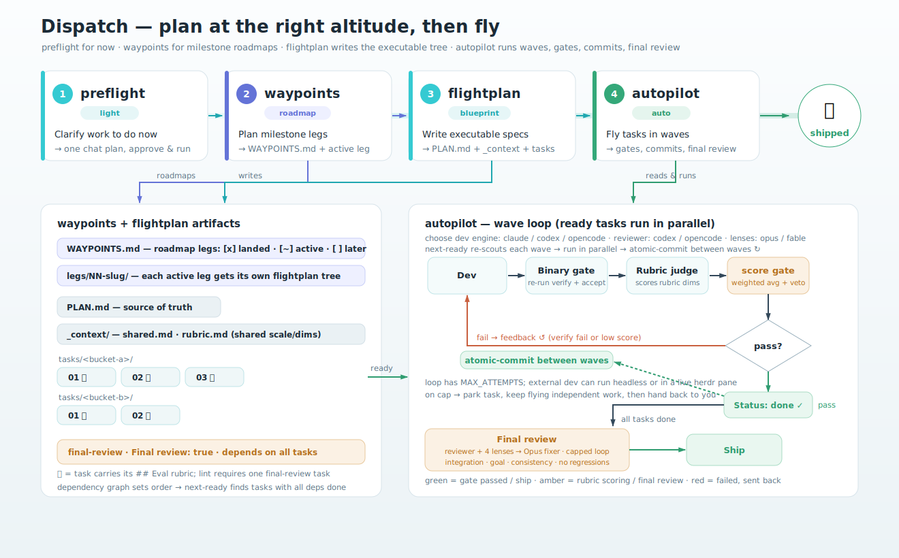

# cc-plugins

A local Claude Code and Codex plugin marketplace for Q's coding workflow. It ships five plugins: **monitor** turns local traces into useful dashboards — the *usage-dashboard* skill is the rear-view mirror for usage history, and the *cockpit* skill is the windshield for the session currently in flight; **dispatch** is interview-driven planning you can then execute — spec the work, write a blueprint to disk, and fly it with a quality loop, or map a whole project into milestone legs and plan each one just-in-time; **relay** delegates a task *out* to another harness's CLI (codex, opencode, or claude) — delegate work, request a review, or generate an image — then captures the result and reports back; **chronicle** authors your git history — commits (auto simple/atomic) and reviewer-legible PRs/MRs; **herdr** is reference plus a typed wrapper for driving agents across panes in the [Herdr](https://herdr.dev) terminal workspace manager.

## Development Workflow

This repository uses GitHub Flow. Create feature and fix branches from `main`, then open pull requests back into `main`. The existing `develop` branch is historical and does not indicate that this repository uses git-flow. Chronicle records this machine-readable PR policy in [`.chronicle/pr.json`](./.chronicle/pr.json).

## Plugins

**monitor** bundles two skills:

| Skill | Description |
|-------|-------------|
| [usage-dashboard](./packages/monitor/skills/usage-dashboard) | Local usage dashboard for Claude Code and Codex: sessions, tokens, cost, model mix, project activity, and live sessions |
| [cockpit](./packages/monitor/skills/cockpit) | Per-project work cockpit for Claude Code and Codex: goal capture, decision log, live transcript, needs-your-call bridge, and a send box for live sessions |

**dispatch** bundles four skills:

| Skill | Description |
|-------|-------------|
| [preflight](./packages/dispatch/skills/preflight) | Lightweight interviewer that gathers requirements into a single in-conversation plan to approve and execute |
| [flightplan](./packages/dispatch/skills/flightplan) | Heavyweight interviewer that writes a multi-file blueprint to disk — `PLAN.md` + a `tasks/` tree of self-contained task files for sub-agents |
| [autopilot](./packages/dispatch/skills/autopilot) | Executes a flightplan tree in parallel waves — a dev→verify→judge→score loop gated on each task's Eval rubric, an atomic commit between waves, then the closing final-review gate, leaving an audit trail |
| [waypoints](./packages/dispatch/skills/waypoints) | Rolling-wave milestone-roadmap tier *above* flightplan — writes only `docs/<proj>/WAYPOINTS.md` plus a `waypoints.ts` CLI (`active` / `leg-scaffold` / `advance`) so each leg's flightplan is planned just-in-time after the previous leg lands |

**relay** is a single portable skill:

| Skill | Description |
|-------|-------------|
| [relay](./packages/relay/skills/relay) | Delegate a task to another harness's CLI (codex / opencode / claude): `delegate` (do work), `review` (analysis only), or `image` (codex only) — capture the result, smart-apply when safe, and report back |

**chronicle** bundles two skills:

| Skill | Description |
|-------|-------------|
| [commit](./packages/chronicle/skills/commit) | Craft git commit(s) for the current changes — auto-decides between one simple commit and an atomic split |
| [pr](./packages/chronicle/skills/pr) | Open a reviewer-legible PR/MR for the current branch, enriched by the cockpit decision trail when present |

**herdr** is a single skill:

| Skill | Description |
|-------|-------------|
| [herdr](./packages/herdr/skills/herdr) | Reference for the [Herdr](https://herdr.dev) terminal workspace manager (config, CLI, plugin dev) plus a typed `herd` wrapper to spawn and drive agents in sibling panes when running inside herdr |

## Claude Code Installation

### CLI

```bash
claude plugins marketplace add FunnyQ/cc-plugins
claude plugins install monitor@q-lab-marketplace
```

### TUI

1. Open Claude Code
2. Type `/plugins` to open the plugin manager
3. Select **Add Marketplace** → enter `FunnyQ/cc-plugins`
4. Select **Install Plugin** → choose `monitor`

The usage-dashboard skill runs a prerequisite check automatically before launching the dashboard, so there's no manual setup step. If something is missing, the hint is surfaced in the terminal. The most common case is `stats-cache.json` not existing yet; run `/stats` once in Claude Code to seed it.

If you want to run the precheck yourself:

```bash
bun $CLAUDE_PLUGIN_ROOT/skills/install/scripts/install.ts
```

## Codex Installation

Codex reads this marketplace from `.agents/plugins/marketplace.json`. The Codex marketplace entry installs `monitor` (both skills).

```bash
codex plugin marketplace add FunnyQ/cc-plugins
codex plugin add monitor@q-lab-marketplace
```

Check the install:

```bash
codex plugin list | rg 'q-lab-marketplace|monitor'
```

After installing a Codex plugin, start a new Codex session so the skill list is refreshed.

## usage-dashboard

A single-page dashboard that reads local `~/.claude/` and `~/.codex/` data and visualizes usage in a browser. No telemetry, no cloud; everything stays on your machine.



### Features

- **Live now (Claude + Codex)** — a panel of your currently-active Claude and Codex sessions with live status; click one to open it in cockpit's live transcript view (token-atlas links out rather than rendering transcripts itself). When cockpit's daemon isn't running the panel says so and the rows stay inert, so a click never opens a dead tab
- **Cost + usage overview** — sessions, interactions, tokens, estimated spend, daily burn, and monthly budget projection
- **Persistent history** — Claude usage is rolled into a local SQLite store (`~/.local/share/q-lab/token-atlas/`), so your token/cost/model history survives Claude Code's automatic transcript cleanup (`cleanupPeriodDays`) instead of disappearing as old sessions age out
- **Model analysis** — daily trend, model distribution, and per-model token/cost breakdown
- **Project insights** — project rankings with drilldown details for model mix and cost
- **Session ledger** — recent Claude and Codex sessions side by side
- **Anomaly detection** — flags days that break from your recent baseline
- **Token composition** — input, output, cache-read, cache-write, and reasoning token shares
- **Activity timeline** — hourly and daily activity patterns from local session data
- **Data health diagnostics** — non-fatal source-read failures and record counts
- **Filters + export** — provider/range filters, persisted preferences, and JSON/CSV export

### Prerequisites

- [Bun](https://bun.sh) runtime
- At least one Claude Code session
- For Claude usage totals, run `/stats` once to seed `stats-cache.json`

### Quick Start

```bash
bun packages/monitor/skills/usage-dashboard/scripts/atlas-server.ts
```

Opens `http://localhost:5938` in your default browser.

### Options

```
--port <n>    Use a different port (default: 5938)
--no-open     Don't auto-open browser
```

### Pricing

Token costs are estimated using bundled defaults (`references/pricing-defaults.json`). On startup, live prices are fetched from OpenRouter (3s timeout, silent fail). You can override with a custom file:

```
~/.config/cc-dashboard/pricing.json
```

```json
{
  "models": {
    "claude-opus-4-7": { "input": 5.00, "output": 25.00, "cacheRead": 0.50, "cacheWrite": 6.25 }
  }
}
```

## cockpit

Cockpit is a per-project dashboard and skill for active work. Start with a session goal, keep a distilled decision log, stream the current Claude Code or Codex transcript, and park on `needs_your_call` so a button click in the dashboard wakes the session.



### Quick Start

In Claude Code or Codex, invoke the cockpit skill and confirm the proposed goals. From a development checkout, the dashboard can also be started directly:

```bash
bun packages/monitor/skills/cockpit/scripts/cockpit-server.ts
```

Opens `http://localhost:5858` in your default browser.

### Provider Support

- Claude Code transcripts resolve from `~/.claude/projects/**/<session>.jsonl`.
- Codex transcripts resolve from `~/.codex/state_5.sqlite` thread rows and rollout files under `~/.codex/sessions`.
- Decision logs live per-project under `.cockpit/`; the registry and wait/send bridge are shared through `~/.local/share/q-lab/cockpit/`.

### Channel (send box)

The send box at the bottom of the Decision Log column can send text into a running session.

- **Claude Code** uses the cockpit channel MCP server. The agent's answer comes back through the live transcript.
- **Codex** uses the managed Codex remote-control daemon. Cockpit connects to the local app-server control socket, resumes the selected thread, and submits or steers a turn. Direct app-server is only a fallback when remote-control is unavailable.

Channels require Claude Code 2.1.80 or later and are still behind the research-preview development flag. Register the channel MCP server once in `~/.claude.json`, pointing at the installed plugin's `cockpit-channel.ts` (note: `~/.claude.json` does not expand `$CLAUDE_PLUGIN_ROOT`, so use an absolute path):

```json
{
  "mcpServers": {
    "cockpit-channel": {
      "command": "bun",
      "args": ["/absolute/path/to/monitor/skills/cockpit/scripts/cockpit-channel.ts"]
    }
  }
}
```

Then launch an opted-in session — the channel only attaches to sessions started with the development channel flag and cannot retro-attach to an already-running session:

```bash
bun packages/monitor/skills/cockpit/scripts/monitor-up.ts
```

Extra arguments pass through to `claude` (e.g. `monitor-up.ts --resume`). See the [cockpit skill README](./packages/monitor/skills/cockpit) for the full setup.

For Codex send support, install and enable the managed standalone Codex remote-control daemon:

```bash
curl -fsSL https://chatgpt.com/codex/install.sh | sh
codex app-server daemon enable-remote-control
```

Cockpit checks `/api/codex-control/status` before enabling the Codex send box, so stale or non-resumable threads stay disabled instead of failing only after send.

## dispatch

Interview-driven planning you can execute. Three skills form one arc — gather the spec, commit a blueprint to disk, then fly it with a multi-agent quality loop — and a fourth, `waypoints`, sits *above* it for whole-project rolling-wave planning.



- **preflight** — a lightweight interview that produces a single in-conversation plan. Best when you'll execute now, in one session.
- **flightplan** — a thorough interview that writes `docs/<slug>/PLAN.md` plus a `tasks/` tree of self-contained task files (each with its own `## Eval rubric`). Best when the work spans sessions or hands off to sub-agents.
- **autopilot** — executes that tree in **waves**. Each wave re-scouts the ready set (`next-ready`) and runs those tasks in parallel; for each task it runs Dev → an independent binary gate (re-runs the task's Verification) → a rubric judge → a deterministic score gate, retrying until the task passes its rubric. Between waves it makes an **atomic commit** of the completed work, so the run leaves a clean per-wave history rather than one giant diff. The `Final review` task depends transitively on every other task, so the wave loop naturally schedules it last as the whole-tree gate — a closing multi-lens review round (cross-vendor `codex` + four `/simplify` lenses → an Opus fixer), followed by a final commit of its fixes. Every verdict lands in a self-gitignored `docs/<slug>/.flightlog/` audit trail (`RUNLOG.md`).
- **waypoints** — the tier *above* flightplan for large builds. It writes only a milestone **roadmap** (`docs/<proj>/WAYPOINTS.md`, legs tracked with `[x]`/`[~]`/`[ ]`); each leg's detailed flightplan is generated **just-in-time** after the previous leg lands, so every plan starts from what actually shipped rather than one oversized up-front guess. A `waypoints.ts` CLI collapses the lifecycle into three verbs — `active` (rolling-wave digest), `leg-scaffold` (nest a leg's tree under `docs/<proj>/legs/NN-slug/`), and `advance` (land the active leg; writing requires `--outcome` as the confirmation gate). `flightplan` gains a narrow **waypoint mode** that plans one leg at a time. Human-in-loop by design — one leg lands before the next is planned.

### Installation

```bash
# Claude Code
claude plugins install dispatch@q-lab-marketplace

# Codex
codex plugin add dispatch@q-lab-marketplace
```

(Add the marketplace first if you haven't — see the monitor install steps above.)

## relay

One portable skill that delegates a task *out* to another harness's CLI, then captures the output and reports back — a multi-backend generalization of the codex-only `odin-codex` skill.

```
/relay <codex|opencode|claude> delegate <task>
/relay <codex|opencode|claude> review [task]
/relay codex image <prompt> --out <path>
```

- **delegate** — ask a backend to *do* something (implement, refactor, debug); smart-applied when safe.
- **review** — analysis only, no edits. No task reviews uncommitted changes; a provided task is followed as written.
- **image** — generate an image via codex (gpt-image-2). codex-only; `opencode`/`claude` fail fast at the capability gate.

A capability gate rejects unsupported (backend, mode) pairs before any CLI runs. Every run captures full output to `/tmp/relay/<ts>/last.md` and prints it. Models resolve by precedence: `--model` flag > config file (`~/.config/q-lab/cc-plugins/relay/config.json`) > built-in defaults. Per-CLI invocation details, headless output handling, and the OpenCode symlink install live in the [backend reference](./packages/relay/skills/relay/references/backends.md).

**Live-pane mode** — inside [herdr](https://herdr.dev) (`HERDR_ENV=1`), delegate/review automatically run the backend's interactive TUI in a visible, take-over-able pane opened in **its own new tab** (so your working pane keeps its full size), via the herdr plugin's `herd.ts`, dynamically imported — no hard dependency. The answer is captured through a result-file contract; stdout stays the clean answer, live metadata rides stderr. `--dangerous` makes it a **YOLO / unattended** run (auto-approves permissions: codex/claude bypass flags, opencode `--auto`); without it, approval prompts surface in the pane for a human to answer. A run that outlives `--wait-timeout` (default 10 min) exits 0 with a "still running" report and leaves the pane alive. `--headless` opts out; outside herdr the classic headless flow is unchanged.

### Installation

```bash
# Claude Code
claude plugins install relay@q-lab-marketplace

# Codex
codex plugin add relay@q-lab-marketplace

# OpenCode (reads ~/.claude/skills/) — one-time symlink
ln -s "$(pwd)/packages/relay/skills/relay" ~/.claude/skills/relay
```

## herdr

Reference and in-session agent orchestration for [Herdr](https://herdr.dev), a terminal workspace manager with workspaces, tabs, split panes, and agent detection. Two halves:

- **Reference** — a knowledge skill that answers questions about Herdr's `config.toml`, CLI, keybindings, and plugin development. Detail lives in `references/`; the skill reads only the relevant file.
- **`herd` wrapper** — a typed Bun wrapper (`scripts/herd.ts`) over the raw `herdr` CLI, for when you (an agent) are running *inside* a herdr pane (`HERDR_ENV=1`) and want to spawn and drive other agents in sibling panes or their own tabs (`spawn --new-tab`). It collapses herdr's multi-step recipes into seven verbs and handles the sharp edges: it addresses agents by a **collision-resistant generated name** (pane ids renumber), its `send` writes the prompt **and presses Enter** (raw `agent send` only writes literal text), its `keys` verb sends bare key chords (submit / clear the input box), and its `read` defaults to the visible screen (agent TUIs leave scrollback empty).

```bash
HERD="$CLAUDE_PLUGIN_ROOT/skills/herdr/scripts/herd.ts"   # or the skill's load-time base dir

bun "$HERD" spawn reviewer --agent codex --task "review the diff in src/api/"
bun "$HERD" send reviewer-a3f9 "now check error handling"
bun "$HERD" wait reviewer-a3f9 --status idle --timeout 120000
bun "$HERD" read reviewer-a3f9 --lines 60
bun "$HERD" list
bun "$HERD" close reviewer-a3f9
```

All verbs print JSON except `read` (prints the pane's text). The wrapper honors `HERDR_BIN_PATH` and fails fast when not inside herdr.

### Installation

```bash
# Claude Code
claude plugins install herdr@q-lab-marketplace

# Codex
codex plugin add herdr@q-lab-marketplace
```

## Adding a New Plugin

1. Create a directory with `.claude-plugin/plugin.json` and/or `.codex-plugin/plugin.json`
2. Add skills under `skills/<skill-name>/SKILL.md`
3. Register Claude plugins in `.claude-plugin/marketplace.json`
4. Register Codex plugins in `.agents/plugins/marketplace.json`

## License

MIT
