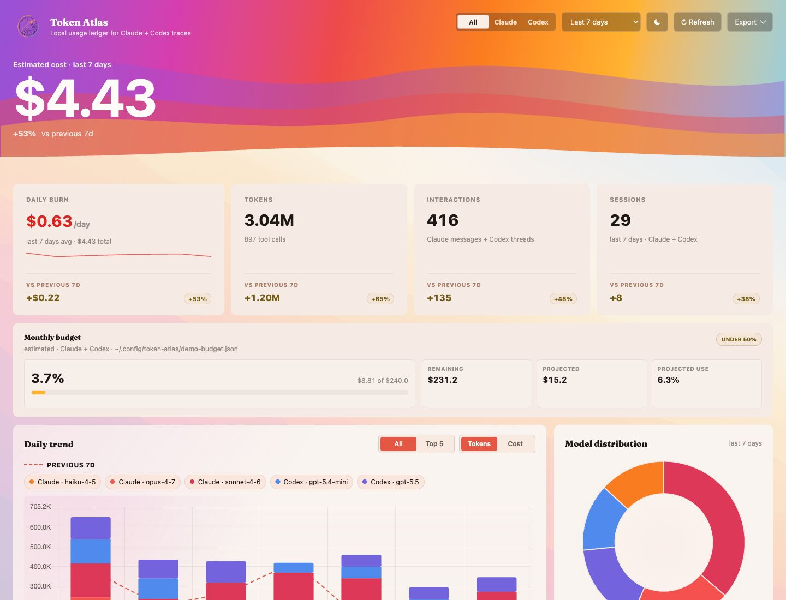

# cc-plugins

A local Claude Code plugin marketplace. Private plugins for extending Claude Code with custom skills.

## Plugins

| Plugin | Description |
|--------|-------------|
| [token-atlas](./token-atlas) | Local web dashboard for Claude Code & Codex usage — sessions, tokens, cost, model mix, project activity |

## Installation

### CLI

```bash
claude plugins marketplace add FunnyQ/cc-plugins
claude plugins install token-atlas@q-lab-marketplace
```

### TUI (interactive)

1. Open Claude Code
2. Type `/plugins` to open the plugin manager
3. Select **Add Marketplace** → enter `FunnyQ/cc-plugins`
4. Select **Install Plugin** → choose `token-atlas`

The skill runs a prerequisite check automatically before launching the dashboard, so there's no manual setup step. If something's missing, the hint will be surfaced — the most common case is `stats-cache.json` not yet existing; just run `/stats` once in Claude Code to seed it.

If you want to run the precheck yourself:

```bash
bun $CLAUDE_PLUGIN_ROOT/skills/dashboard/scripts/install.ts
```

## token-atlas

A single-page dashboard that reads your local `~/.claude/` and `~/.codex/` data and visualizes it in a browser. No telemetry, no cloud — everything stays on your machine.



### Features

- **Live now (Claude + Codex)** — a panel of your currently-active Claude and Codex sessions with live status; click one to open a real-time transcript that streams as the session is written, with scroll-to-top history loading, GFM Markdown rendering, syntax-highlighted code blocks, inline color-coded file diffs, and collapsible tool calls/results
- **Cost + usage overview** — sessions, interactions, tokens, estimated spend, daily burn, and monthly budget projection
- **Model analysis** — daily trend, model distribution, and per-model token/cost breakdown
- **Project insights** — project rankings with drilldown details for model mix and cost
- **Session ledger** — recent Claude and Codex sessions side by side
- **Anomaly detection** — flags days that break from your recent baseline
- **Token composition** — input, output, cache-read, cache-write, and reasoning token shares
- **Activity timeline** — hourly and daily activity patterns from local session data
- **Data health diagnostics** — non-fatal source-read failures and record counts
- **Filters + export** — provider/range filters, persisted preferences, and JSON/CSV export

### Prerequisites

- [Bun](https://bun.sh) runtime
- At least one Claude Code session (run `/stats` once to seed `stats-cache.json`)

### Quick Start

```bash
bun token-atlas/skills/dashboard/scripts/serve-dashboard.ts
```

Opens `http://localhost:5938` in your default browser.

### Options

```
--port <n>    Use a different port (default: 5938)
--no-open     Don't auto-open browser
```

### Pricing

Token costs are estimated using bundled defaults (`references/pricing-defaults.json`). On startup, live prices are fetched from OpenRouter (3s timeout, silent fail). You can override with a custom file:

```
~/.config/cc-dashboard/pricing.json
```

```json
{
  "models": {
    "claude-opus-4-7": { "input": 5.00, "output": 25.00, "cacheRead": 0.50, "cacheWrite": 6.25 }
  }
}
```

## Adding a New Plugin

1. Create a directory with `.claude-plugin/plugin.json`
2. Add skills under `skills/<skill-name>/SKILL.md`
3. Register in `.claude-plugin/marketplace.json`

## License

MIT
