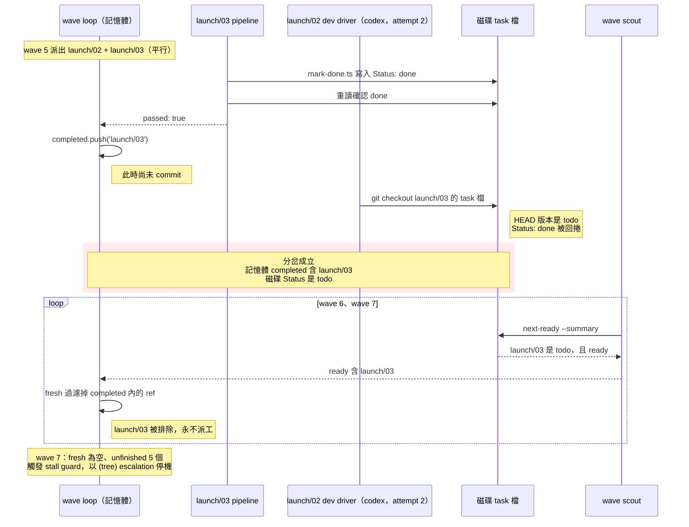

# autopilot：平行 sibling 洗掉 Status，記憶體與磁碟分岔成假性 stall

> **Status**: fixed（待實跑驗證）
> **Owner**: Q
> **Reported**: 2026-08-02
> **Fixed**: 2026-08-02
> **Observed in**: dispatch 3.18.1，run `wf_5903a02b-b6e`

## 摘要

autopilot 跑 herdr-workbench 的 `docs/workbench-config-schema` 計畫（11 個任務，`devEngine: 'codex'` + live relay pane），在 7/11 停機。

停機訊息是 `(tree)` stall：`stalled in wave 7: no ready task, but 5 of 11 are unfinished`。該訊息與真正的成因無關。

真正的成因是兩個各自獨立的缺陷疊在一起。一個平行任務用 `git checkout` 回捲了另一個平行任務的 task 檔，wave loop 又完全信任自己的記憶體狀態，於是那個任務永遠不會再被派工。

## 重現時序

Wave 5 同時派出 `launch/02` 與 `launch/03`。兩者都改 `src/flows/agent.rs`，是合法的平行 ready sibling。



各 wave scout 快照（取自 `journal.jsonl`）顯示 `counts.done` 從 wave 6 起卡在 6，而 `completed` 已累積到 7：

| wave | ready | counts.done | completed 長度 |
|---|---|---|---|
| 5 | `launch/02`, `launch/03` | 4 | 4 |
| 6 | `launch/01`, `launch/03` | 5 | 6 |
| 7 | `launch/03` | 6 | 7 |

`launch/03` 的程式碼本身有落地並被 commit（`d0d02cc`）。遺失的只有 task 檔的 Status 標記。

## 證據

執行紀錄在 herdr-workbench 這一場 session 的 workflow transcript 目錄：

```
~/.claude/projects/-Users-funnyq-Projects-q-lab-herdr-workbench/9db401ed-c7af-40b1-a800-4837e98fd42a/subagents/workflows/wf_5903a02b-b6e/
```

- `agent-a7ba5c8de8e833cb3.jsonl` — `launch/02` 的 codex dev driver，retry attempt 2。其中一筆 Bash tool_use 的 command 是 `git checkout docs/workbench-config-schema/tasks/launch/03-side-panes-from-layout.md`。
- `journal.jsonl` — 七次 wave scout 的完整快照，上表由此而來。

## 缺陷 A：`NO_COMMIT_RULE` 沒擋住 `git checkout`，也沒禁止碰別人的檔案

`packages/dispatch/skills/autopilot/references/orchestrator.md:242` 是唯一的規則來源，注入三個 writer prompt（`:254` Claude dev、`:276` external dev driver、`:362` final-review fixer）。

現行文字列舉 `git commit`、`git add`、`git push`、`git stash`，把 `git checkout` / `git restore` / `git reset` 丟給結尾的「any other command that changes git state」概括條款。

**那個概括條款照字面根本涵蓋不到。** `git checkout -- <path>` 改寫的是工作區，refs 與 index 都不動 —— 它不改 git state。所以這不是 Haiku 沒套用概括條款，而是嚴謹的讀者也會得出「這條沒禁」的結論。規則本身有洞。

規則的理由段落（`orchestrator.md:921`）整段只談「任務自己 commit」會壞掉什麼，完全沒提回捲。規則也從未說「不要碰別的任務的檔案」，即使平行 wave 是常態。

`orchestrator.md:924` 有一段相關但方向相反的建議：真的會互相衝突的任務，應該在 flightplan 加 `Depends on` 邊、避免同 wave。那是計畫端的解法，不能取代 prompt 端的護欄。

## 缺陷 B：wave loop 把記憶體 `completed` 當權威，從不與磁碟對帳

`completed` 在 `orchestrator.md:640` 宣告，在 `:848` 累加。

`fresh` 過濾器在 `orchestrator.md:793-794`：

```javascript
const fresh = ready.filter(
  i => !parked.has(i.ref) && !completed.includes(i.ref))
```

註解說這是 defense-in-depth，防止行為異常的 scout 重跑已完成的工作。它同時也讓任何從 `done` 退回 `todo` 的 ref 永久無法被派工。

`orchestrator.md:898` 已經明確寫下「`completed.length` 不是完成數，`counts.done` 才是」，並用它避免 resume 時的假 stall。同一個洞察沒有被用在反方向：`completed` 多於 `counts.done` 同樣是訊號，而且是更嚴重的那一種。

分岔最後被 `:799-808` 的 stall guard 吸收，輸出一則不指名真因的通用訊息。`orchestrator.md:900` 列出的八個終止條件裡沒有這一項。

## 偵測訊號：集合交集，不是計數比較

每個 wave 拿到 scout 快照後，取 `completed` 與 scout `unfinished` 的交集：

```javascript
const diverged = completed.filter(ref => unfinished.some(u => u.ref === ref))
```

非空即代表磁碟與記憶體不一致。這是一個獨立的終止條件，不是 stall。

**不要用 `completed.length > counts.done`。** 那個條件在 resume 情境會完全失效：resume 會繼承前次跑完的 `done`，`counts.done` 本來就大於 `completed.length`，即使真的發生回捲，不等式也永遠不成立。也就是說，它偏偏在最難察覺回捲的那類跑法上保持沉默。

交集則兩種情境都正確：`unfinished` 收的是所有 `state !== "done"` 的任務（`next-ready.ts:216`），而 resume 時 `completed` 裡的 ref 在磁碟上都是真的 `done`，天然不相交。交集本身就是 escalation 要印的 ref 清單 —— 使用者拿到 ref 才能判斷是回捲、是手動改動、還是 `mark-done` 假成功。

**位置**：必須放在 `orchestrator.md` 的 `fresh` 過濾之前。過濾器會把 `completed` 內的 ref 丟掉，之後那個分岔任務既不會被重新派工、也不會被回報，整場跑最後死在一則指錯原因的通用 stall。

## 修法選項

### 缺陷 A

| 選項 | 做法 | 取捨 |
|---|---|---|
| A1 | 在 `NO_COMMIT_RULE` 明確列出 `git checkout` / `git restore` / `git reset` | 一行字，零風險，但只擋列舉到的指令 |
| A2 | 在 A1 之上，補平行語意；但禁令要**拆成兩條互不重疊**的規則 | 涵蓋整類問題而非單一指令；prompt 變長，但這是唯一講得清平行語意的地方 |
| A3 | 在 dev driver prompt 加獨立的 sibling-file guard 段落，明列本任務可碰的檔案 | 最強，但要把 task 檔的「Files to create / modify」清單傳進 prompt，改動面較大 |
| A4 | 靠 PostToolUse hook 攔截 | 攔不到——external engine 在 harness 之外寫檔，`orchestrator.md:921` 自己已經記下這點 |

**選 A2。** A1 太窄，下一個沒列到的指令會重演。A3 的成本不對稱：它解的是同一個問題，卻要改動 prompt 組裝邏輯。A4 對 external engine 無效。

**A2 的措辭要拆兩條，不能寫成「不得修改任何不屬於本任務的檔案」。** 這次 `launch/02` 與 `launch/03` 都合法地改 `src/flows/agent.rs` —— 共用原始碼正是平行 wave 的常態。一條籠統禁令照字面讀會擋掉計畫本身排定的工作，而讀 prompt 的是 Haiku，它會照字面讀。兩條分開：

1. **不得執行丟棄工作區改動的指令**（`git checkout` / `git restore` / `git reset` / `git clean`），理由寫明：同一棵工作樹裡有平行任務尚未 commit 的改動；自己改壞就往前修，不要還原。
2. **不得編輯 `tasks/` 底下其他任務的檔案** —— 那裡面有它的 Status 行。

共用原始碼照舊可改。

### 缺陷 B

| 選項 | 做法 | 取捨 |
|---|---|---|
| B1 | 每 wave 取 `completed` ∩ `unfinished`，非空即以專屬訊息 escalate 並停機 | 快速失敗、訊息精準；停機而非自我修復 |
| B2 | 偵測到分岔就把該 ref 從 `completed` 移除、允許重新派工 | 會自我修復，但等於重跑已通過的任務，且掩蓋了「有東西在回捲檔案」這個事實 |
| B3 | 放寬 `fresh` 過濾器，只排除 `parked`，不排除 `completed` | 移除的是一道刻意的護欄；scout 若異常會無限重跑 |

**選 B1。** 分岔代表有東西在動不該動的檔案，那是要修的 bug，不是要繞過的狀態。B2 會讓同一個回捲行為靜靜地重複發生。B3 拆掉現有護欄換來另一個風險。

### 改哪裡

`orchestrator.md` 是權威來源，兩個修法都落在那裡。另外兩處連帶要改：

- **終止條件數量寫死在兩個地方**，加一個就是九，兩處都要改：`orchestrator.md` 的清單本身（原 `:900`），以及 `SKILL.md:138` 那句「orchestrator.md owns the eight terminal conditions」。第二處是 codex review 抓到的 —— 只改權威來源會留下一句指向錯誤數量的轉介文字。
- **escalation 的 task ref 用 `(divergence)`，不要用 `(tree)`。** 檔案裡已有 `(budget)` / `(commit)` 的前例，分岔與 stall 在 `task` 欄位就能分開，不必靠讀 `reason`。

`SKILL.md` 在 Escalation 段落補一句：分岔 escalation 與 park 不同，它代表磁碟被外力改過，使用者要先查是什麼回捲了檔案，再談 resume。escalation 訊息本身也要寫出復原路徑 —— 先確認程式碼是否已落地，再決定把 Status 改回 `done` 還是重設為 `todo`。`SKILL.md` 的 resume 說明只涵蓋 parked，不涵蓋這種。

不需要動 `next-ready.ts` 或 `mark-done.ts`——它們兩邊都做對了。

## 回歸測試

`packages/dispatch/skills/autopilot/scripts/orchestrator-script.test.ts` 會抽出 `orchestrator.md` 的 fenced JS 區塊，以 stub 過的 `agent` / `parallel` / `log` / `phase` 執行。不會生出任何 agent，也不碰檔案。

分岔條件可以完全在這裡測。用 `runOrchestrator({ scouts: [...] })` 餵三個快照：

1. wave 1：`ready: [ready("ui/01"), ready("ui/02")]`，兩個都通過。
2. wave 2：`counts.done` 只加 1，`ui/02` 仍出現在 `ready` 與 `unfinished`——即回捲後的樣子。
3. 斷言 escalation 的 `task` 是 `(divergence)`、`reason` 命中分岔字樣且含 `ui/02`、不含未受影響的 `ui/03`、也不命中 `stalled`。

既有的 `"a resumed tree counts earlier-run done tasks and does not false-stall"`（`orchestrator-script.test.ts:355`）是反向案例，必須保持綠燈，證明新檢查不會誤傷 resume。

跑：

```bash
bun test packages/dispatch/skills/autopilot/scripts/orchestrator-script.test.ts
```

## 已實作

A2 與 B1 都已落在本 repo，尚未實跑驗證。

| 位置 | 改動 |
|---|---|
| `orchestrator.md` `NO_COMMIT_RULE` | 拆兩條禁令：restore 家族（含「概括條款涵蓋不到」的理由）+ 不得碰他人 task 檔；明說共用原始碼可改。三個注入點共用同一常數不變 |
| `orchestrator.md` wave loop | `fresh` 過濾前插入交集分岔檢查，以 `(divergence)` escalate 並停機，訊息含 ref 與復原步驟 |
| `orchestrator.md` 終止條件 | Eight → Nine，列入 divergence |
| `orchestrator.md` Notes | 新增一則「分岔是集合交集，不是計數比較」，記下 resume 反向與位置約束；`NO_COMMIT_RULE` 理由段補上回捲情境與「為何不寫成籠統禁令」 |
| `SKILL.md` Escalation | 新增「`(divergence)` 不是 park」段落 |
| `orchestrator-script.test.ts` | 新增回捲案例；`resume` 反向案例維持綠燈 |

該次 run 的 persisted script 也曾就地緩解過，那份只影響那一場：

```
~/.claude/projects/-Users-funnyq-Projects-q-lab-herdr-workbench/9db401ed-c7af-40b1-a800-4837e98fd42a/workflows/scripts/autopilot-run-wf_5903a02b-b6e.js
```

**尚未驗證**：這兩個修法都還沒在真實的平行 wave 上跑過。回歸測試只證明分岔條件會觸發且不誤傷 resume，證明不了加固後的 prompt 真能讓 Haiku driver 收手。

## 受影響範圍

任何有平行 wave 的 flightplan 都可能中招。同 wave 的任務改到相鄰程式碼時風險最高——那正是 dev engine 會想「清乾淨」工作區的時機。

單線計畫（每個 wave 只有一個 ready 任務）不受缺陷 A 影響。缺陷 B 需要缺陷 A 或其他外力先造成回捲才會顯現。
