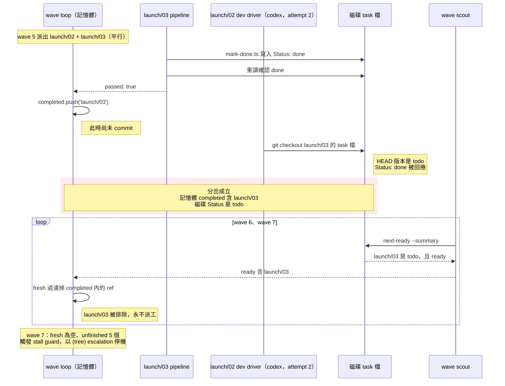
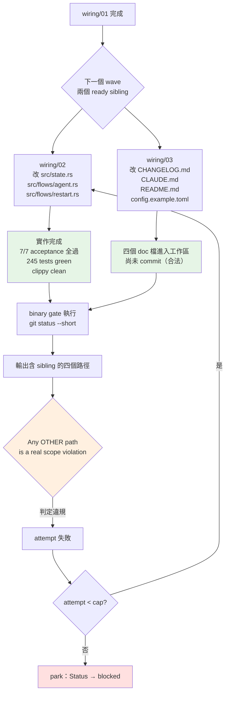

# 平行 wave 共用一棵工作樹：autopilot 兩個缺陷、flightplan 一個缺陷

> **Status**: A、B 已修（待實跑驗證）；C 未修
> **Owner**: Q
> **Reported**: 2026-08-02
> **Fixed**: 2026-08-02（僅 A、B）
> **Observed in**: dispatch 3.18.1，run `wf_5903a02b-b6e`（A、B）、`wf_39832091-0e0`（C）

## 摘要

autopilot 跑 herdr-workbench 的 `docs/workbench-config-schema` 計畫（11 個任務，`devEngine: 'codex'` + live relay pane），連續兩場都在平行 wave 上出事。同一個根源：**同一個 wave 的多個任務共用一棵工作樹，而所有判定都讀那棵樹的全域狀態。**

三個缺陷，兩個歸屬：

| | 缺陷 | 歸屬 | 狀態 |
|---|---|---|---|
| A | `NO_COMMIT_RULE` 沒擋住 `git checkout`，也沒禁止碰別人的檔案 | autopilot | 已修 |
| B | wave loop 把記憶體 `completed` 當權威，從不與磁碟對帳 | autopilot | 已修 |
| C | task 的 scope 檢查斷言整棵工作樹，平行 wave 下必假陰性 | **flightplan** | **未修** |

**失效模式一（缺陷 A + B，run `wf_5903a02b-b6e`）** —— 在 7/11 停機。停機訊息是 `(tree)` stall：`stalled in wave 7: no ready task, but 5 of 11 are unfinished`，與真正的成因無關。一個平行任務用 `git checkout` 回捲了另一個平行任務的 task 檔，wave loop 又完全信任自己的記憶體狀態，於是那個任務永遠不會再被派工。

**失效模式二（缺陷 C，run `wf_39832091-0e0`）** —— 在 10/11 停機。`wiring/02` 三次嘗試都被判 `SCOPE VIOLATION` 而 park，但實作從頭到尾都是對的。它的 scope 檢查讀整棵樹的 `git status`，看到的是同 wave 平行 sibling `wiring/03` 合法的未 commit 改動。詳見〈缺陷 C〉。

## 重現時序（失效模式一）

Wave 5 同時派出 `launch/02` 與 `launch/03`。兩者都改 `src/flows/agent.rs`，是合法的平行 ready sibling。



各 wave scout 快照（取自 `journal.jsonl`）顯示 `counts.done` 從 wave 6 起卡在 6，而 `completed` 已累積到 7：

| wave | ready | counts.done | completed 長度 |
|---|---|---|---|
| 5 | `launch/02`, `launch/03` | 4 | 4 |
| 6 | `launch/01`, `launch/03` | 5 | 6 |
| 7 | `launch/03` | 6 | 7 |

`launch/03` 的程式碼本身有落地並被 commit（`d0d02cc`）。遺失的只有 task 檔的 Status 標記。

## 證據（失效模式一）

執行紀錄在 herdr-workbench 這一場 session 的 workflow transcript 目錄：

```
~/.claude/projects/-Users-funnyq-Projects-q-lab-herdr-workbench/9db401ed-c7af-40b1-a800-4837e98fd42a/subagents/workflows/wf_5903a02b-b6e/
```

- `agent-a7ba5c8de8e833cb3.jsonl` — `launch/02` 的 codex dev driver，retry attempt 2。其中一筆 Bash tool_use 的 command 是 `git checkout docs/workbench-config-schema/tasks/launch/03-side-panes-from-layout.md`。
- `journal.jsonl` — 七次 wave scout 的完整快照，上表由此而來。

## 缺陷 A：`NO_COMMIT_RULE` 沒擋住 `git checkout`，也沒禁止碰別人的檔案

`packages/dispatch/skills/autopilot/references/orchestrator.md:242` 是唯一的規則來源，注入三個 writer prompt（`:254` Claude dev、`:276` external dev driver、`:362` final-review fixer）。

現行文字列舉 `git commit`、`git add`、`git push`、`git stash`，把 `git checkout` / `git restore` / `git reset` 丟給結尾的「any other command that changes git state」概括條款。

**那個概括條款照字面根本涵蓋不到。** `git checkout -- <path>` 改寫的是工作區，refs 與 index 都不動 —— 它不改 git state。所以這不是 Haiku 沒套用概括條款，而是嚴謹的讀者也會得出「這條沒禁」的結論。規則本身有洞。

規則的理由段落（`orchestrator.md:921`）整段只談「任務自己 commit」會壞掉什麼，完全沒提回捲。規則也從未說「不要碰別的任務的檔案」，即使平行 wave 是常態。

`orchestrator.md:924` 有一段相關但方向相反的建議：真的會互相衝突的任務，應該在 flightplan 加 `Depends on` 邊、避免同 wave。那是計畫端的解法，不能取代 prompt 端的護欄。

## 缺陷 B：wave loop 把記憶體 `completed` 當權威，從不與磁碟對帳

`completed` 在 `orchestrator.md:640` 宣告，在 `:848` 累加。

`fresh` 過濾器在 `orchestrator.md:793-794`：

```javascript
const fresh = ready.filter(
  i => !parked.has(i.ref) && !completed.includes(i.ref))
```

註解說這是 defense-in-depth，防止行為異常的 scout 重跑已完成的工作。它同時也讓任何從 `done` 退回 `todo` 的 ref 永久無法被派工。

`orchestrator.md:898` 已經明確寫下「`completed.length` 不是完成數，`counts.done` 才是」，並用它避免 resume 時的假 stall。同一個洞察沒有被用在反方向：`completed` 多於 `counts.done` 同樣是訊號，而且是更嚴重的那一種。

分岔最後被 `:799-808` 的 stall guard 吸收，輸出一則不指名真因的通用訊息。`orchestrator.md:900` 列出的八個終止條件裡沒有這一項。

## 偵測訊號：集合交集，不是計數比較

每個 wave 拿到 scout 快照後，取 `completed` 與 scout `unfinished` 的交集：

```javascript
const diverged = completed.filter(ref => unfinished.some(u => u.ref === ref))
```

非空即代表磁碟與記憶體不一致。這是一個獨立的終止條件，不是 stall。

**不要用 `completed.length > counts.done`。** 那個條件在 resume 情境會完全失效：resume 會繼承前次跑完的 `done`，`counts.done` 本來就大於 `completed.length`，即使真的發生回捲，不等式也永遠不成立。也就是說，它偏偏在最難察覺回捲的那類跑法上保持沉默。

交集則兩種情境都正確：`unfinished` 收的是所有 `state !== "done"` 的任務（`next-ready.ts:216`），而 resume 時 `completed` 裡的 ref 在磁碟上都是真的 `done`，天然不相交。交集本身就是 escalation 要印的 ref 清單 —— 使用者拿到 ref 才能判斷是回捲、是手動改動、還是 `mark-done` 假成功。

**位置**：必須放在 `orchestrator.md` 的 `fresh` 過濾之前。過濾器會把 `completed` 內的 ref 丟掉，之後那個分岔任務既不會被重新派工、也不會被回報，整場跑最後死在一則指錯原因的通用 stall。

## 修法選項

### 缺陷 A

| 選項 | 做法 | 取捨 |
|---|---|---|
| A1 | 在 `NO_COMMIT_RULE` 明確列出 `git checkout` / `git restore` / `git reset` | 一行字，零風險，但只擋列舉到的指令 |
| A2 | 在 A1 之上，補平行語意；但禁令要**拆成兩條互不重疊**的規則 | 涵蓋整類問題而非單一指令；prompt 變長，但這是唯一講得清平行語意的地方 |
| A3 | 在 dev driver prompt 加獨立的 sibling-file guard 段落，明列本任務可碰的檔案 | 最強，但要把 task 檔的「Files to create / modify」清單傳進 prompt，改動面較大 |
| A4 | 靠 PostToolUse hook 攔截 | 攔不到——external engine 在 harness 之外寫檔，`orchestrator.md:921` 自己已經記下這點 |

**選 A2。** A1 太窄，下一個沒列到的指令會重演。A3 的成本不對稱：它解的是同一個問題，卻要改動 prompt 組裝邏輯。A4 對 external engine 無效。

**A2 的措辭要拆兩條，不能寫成「不得修改任何不屬於本任務的檔案」。** 這次 `launch/02` 與 `launch/03` 都合法地改 `src/flows/agent.rs` —— 共用原始碼正是平行 wave 的常態。一條籠統禁令照字面讀會擋掉計畫本身排定的工作，而讀 prompt 的是 Haiku，它會照字面讀。兩條分開：

1. **不得執行丟棄工作區改動的指令**（`git checkout` / `git restore` / `git reset` / `git clean`），理由寫明：同一棵工作樹裡有平行任務尚未 commit 的改動；自己改壞就往前修，不要還原。
2. **不得編輯 `tasks/` 底下其他任務的檔案** —— 那裡面有它的 Status 行。

共用原始碼照舊可改。

### 缺陷 B

| 選項 | 做法 | 取捨 |
|---|---|---|
| B1 | 每 wave 取 `completed` ∩ `unfinished`，非空即以專屬訊息 escalate 並停機 | 快速失敗、訊息精準；停機而非自我修復 |
| B2 | 偵測到分岔就把該 ref 從 `completed` 移除、允許重新派工 | 會自我修復，但等於重跑已通過的任務，且掩蓋了「有東西在回捲檔案」這個事實 |
| B3 | 放寬 `fresh` 過濾器，只排除 `parked`，不排除 `completed` | 移除的是一道刻意的護欄；scout 若異常會無限重跑 |

**選 B1。** 分岔代表有東西在動不該動的檔案，那是要修的 bug，不是要繞過的狀態。B2 會讓同一個回捲行為靜靜地重複發生。B3 拆掉現有護欄換來另一個風險。

### 改哪裡

`orchestrator.md` 是權威來源，兩個修法都落在那裡。另外兩處連帶要改：

- **終止條件數量寫死在兩個地方**，加一個就是九，兩處都要改：`orchestrator.md` 的清單本身（原 `:900`），以及 `SKILL.md:138` 那句「orchestrator.md owns the eight terminal conditions」。第二處是 codex review 抓到的 —— 只改權威來源會留下一句指向錯誤數量的轉介文字。
- **escalation 的 task ref 用 `(divergence)`，不要用 `(tree)`。** 檔案裡已有 `(budget)` / `(commit)` 的前例，分岔與 stall 在 `task` 欄位就能分開，不必靠讀 `reason`。

`SKILL.md` 在 Escalation 段落補一句：分岔 escalation 與 park 不同，它代表磁碟被外力改過，使用者要先查是什麼回捲了檔案，再談 resume。escalation 訊息本身也要寫出復原路徑 —— 先確認程式碼是否已落地，再決定把 Status 改回 `done` 還是重設為 `todo`。`SKILL.md` 的 resume 說明只涵蓋 parked，不涵蓋這種。

不需要動 `next-ready.ts` 或 `mark-done.ts`——它們兩邊都做對了。

## 回歸測試

`packages/dispatch/skills/autopilot/scripts/orchestrator-script.test.ts` 會抽出 `orchestrator.md` 的 fenced JS 區塊，以 stub 過的 `agent` / `parallel` / `log` / `phase` 執行。不會生出任何 agent，也不碰檔案。

分岔條件可以完全在這裡測。用 `runOrchestrator({ scouts: [...] })` 餵三個快照：

1. wave 1：`ready: [ready("ui/01"), ready("ui/02")]`，兩個都通過。
2. wave 2：`counts.done` 只加 1，`ui/02` 仍出現在 `ready` 與 `unfinished`——即回捲後的樣子。
3. 斷言 escalation 的 `task` 是 `(divergence)`、`reason` 命中分岔字樣且含 `ui/02`、不含未受影響的 `ui/03`、也不命中 `stalled`。

既有的 `"a resumed tree counts earlier-run done tasks and does not false-stall"`（`orchestrator-script.test.ts:355`）是反向案例，必須保持綠燈，證明新檢查不會誤傷 resume。

跑：

```bash
bun test packages/dispatch/skills/autopilot/scripts/orchestrator-script.test.ts
```

## 已實作

A2 與 B1 都已落在本 repo，尚未實跑驗證。

| 位置 | 改動 |
|---|---|
| `orchestrator.md` `NO_COMMIT_RULE` | 拆兩條禁令：restore 家族（含「概括條款涵蓋不到」的理由）+ 不得碰他人 task 檔；明說共用原始碼可改。三個注入點共用同一常數不變 |
| `orchestrator.md` wave loop | `fresh` 過濾前插入交集分岔檢查，以 `(divergence)` escalate 並停機，訊息含 ref 與復原步驟 |
| `orchestrator.md` 終止條件 | Eight → Nine，列入 divergence |
| `orchestrator.md` Notes | 新增一則「分岔是集合交集，不是計數比較」，記下 resume 反向與位置約束；`NO_COMMIT_RULE` 理由段補上回捲情境與「為何不寫成籠統禁令」 |
| `SKILL.md` Escalation | 新增「`(divergence)` 不是 park」段落 |
| `orchestrator-script.test.ts` | 新增回捲案例；`resume` 反向案例維持綠燈 |

該次 run 的 persisted script 也曾就地緩解過，那份只影響那一場：

```
~/.claude/projects/-Users-funnyq-Projects-q-lab-herdr-workbench/9db401ed-c7af-40b1-a800-4837e98fd42a/workflows/scripts/autopilot-run-wf_5903a02b-b6e.js
```

**尚未驗證**：這兩個修法都還沒在真實的平行 wave 上跑過。回歸測試只證明分岔條件會觸發且不誤傷 resume，證明不了加固後的 prompt 真能讓 Haiku driver 收手。

## 缺陷 C：task 的 scope 檢查斷言整棵工作樹（flightplan 端）

**這一個不是 autopilot 的缺陷，是 flightplan 的。** 產生那條不成立的驗證項目的是計畫，不是執行器。autopilot 只是忠實地執行它。

### 發生什麼

Run `wf_39832091-0e0`，`wiring/02`（agent state v2）三次嘗試全部以 `SCOPE VIOLATION` 收場，最後被 park。實作從頭到尾都是對的。事後獨立複驗：

```
245 tests passed · cargo clippy -- -D warnings clean
rg 'HARNESS_CLAUDE|HARNESS_CODEX|HARNESS_OPENCODE' src/  → 無輸出
STATE_VERSION = 2 · LastAgentRecord { agent, option, layout, recorded_at }
六個指定測試全部存在
```

7 條 acceptance criteria 全過。8 條 verification 過了 7 條。唯一沒過的是這條，寫在 task 檔裡：

> Run `git status --short` and quote it. Expect `src/state.rs`, `src/flows/agent.rs`, `src/flows/restart.rs`, plus at most this task file. Any OTHER path is a real scope violation.

被判違規的四個路徑 —— `CHANGELOG.md`、`CLAUDE.md`、`README.md`、`config.example.toml` —— 正好是 `wiring/03` 自己宣告的「Files to create / modify」清單。

`wiring/02` 與 `wiring/03` 都只依賴 `wiring/01`，依賴圖把它們排進同一個 wave。binary gate 讀的是**整棵樹**的 `git status`，它無從分辨哪些改動是自己任務的、哪些是同時在跑的 sibling 的合法產出。

attempt 1 死於真正的原因（codex 當時根本還沒實作）。attempt 2 與 attempt 3 死法完全相同，都是這條假陰性。



綠色的兩個框自始至終都是對的。整條假陰性路徑上，沒有任何一個真實的品質訊號變紅。

### 這不是作者寫錯，是模板教的

最尖銳的部分在這裡。那條失效的驗證項目**逐字就是 `task-template.md:159` 標記為 ✅ 的推薦寫法**：

```
❌ Run `git status --short` — expect `README.md` as the only modified path.
❌ `git status --short` shows nothing else modified.
✅ Run `git status --short` and quote it. Expect `README.md`, plus at most this
   task file. Any OTHER path is a real scope violation.
```

那個 ✅ 是為了修**另一個**問題而寫的。`task-template.md:161-163` 記錄了先前一次實跑事故：runner 自己會編輯 task 檔（dev step 寫 `Status: in-progress`，`mark-done.ts` 勾掉每個 gate box），所以任何「只有這一個路徑」的排他宣告從第一次嘗試就是假的；而 dev agent 為了讓 gate 過，會回捲 runner 的 `Status` 編輯 —— 該段原文記著 agent 回報「task file correctly restored」。

**那正是缺陷 A 的機制，早就被記錄過一次了。** 當時的對策是把排他宣告改成「plus at most this task file」，讓 task 檔自己的 bookkeeping 合法化。

該對策解決了**自傷**的情況，完全沒有考慮**平行 sibling**。加了豁免之後，斷言仍然是全樹否定式：「任何其他路徑都是違規」。序列計畫成立，平行 wave 必假陰性。

`lint-task.ts` 也只擋得住排他變體。判定式在 `scripts/lint-task.ts:113-125`，門檻是 `EXCLUSIVITY_REGEX`（`:107`）：

```javascript
const EXCLUSIVITY_REGEX = /\b(only|sole|nothing else|no other)\b/i;
```

`wiring/02` 那條寫的是 `Any OTHER path`，不含任何一個關鍵字 —— 它按設計通過 lint。**目前這個模式不但沒被擋，還是被推薦、被 lint 背書的。**

### 通則

> task 的 scope 檢查只能對**自己宣告的檔案清單做肯定式斷言**。全樹否定式斷言（「不得有其他路徑變動」）只在嚴格序列的計畫裡成立。

判定依據不在措辭，在依賴圖：任務 X 與 Y 可能同 wave，若且唯若兩者互不在對方的遞移依賴閉包內。

### 修法選項

| 選項 | 做法 | 取捨 |
|---|---|---|
| C1 | 改成 pathspec 肯定式：`git status --short -- <本任務宣告的檔案>`，斷言它們**有**變動 | 平行下永遠成立；但放棄了「偵測越界」這個原本的目的 |
| C2 | 整條刪掉，讓 acceptance criteria 與測試承擔正確性 | 最簡單；越界改動完全失去專屬訊號 |
| C3 | flightplan 對「可能同 wave」的任務拒絕產出全樹 scope 檢查，序列任務照舊 | 精準；需要 lint 具備依賴圖意識 |
| C4 | autopilot 端讓 verifier 忽略同 wave sibling 的路徑 | 治標且做不到——verifier 是獨立 agent，不知道 wave 成員名單 |

**選 C1 + C3。**

先說為什麼不是 C1 單獨。**C1 其實會摧毀這個 gate 原本的用途。** 這條檢查存在是為了抓「dev engine 亂改宣告範圍外的檔案」，而 `git status --short -- <自己的檔案>` 只印自己的檔案，對越界一無所知。單靠 C1 等於偷偷把 gate 換成別的東西。

必須誠實承認的是：**平行 wave 下，那個資訊根本不在工作樹裡。** 一個路徑髒了，可能是自己越界，也可能是 sibling 的正當工作，`git status` 兩者長得一模一樣。要嘛放棄這個訊號，要嘛只在序列時才用它。

所以 C1 的價值不在取代，而在**回收剩下還成立的那一半**：肯定式斷言仍然抓得到「codex 什麼都沒實作」—— 那正是 `wiring/02` attempt 1 真正該失敗的原因。用 C2 整條刪掉會連這個都丟掉。

C3 則把否定式檢查保留給它唯一成立的場合。兩者合起來，模板要有**兩個** ✅ 範例，依任務是否可能同 wave 分流：

- 可能同 wave → 只寫肯定式 pathspec。
- 嚴格序列 → 可續用現行全樹否定式（仍保留 `plus at most this task file` 豁免）。

C4 列出只為記錄它為何不可行。

### 改哪裡

| 位置 | 改動 |
|---|---|
| `flightplan/references/task-template.md:153-165`〈Never gate scope on `git status`〉 | 標題已不精確——問題不是「用了 `git status`」而是「做了全樹否定式斷言」。改寫成兩個 ✅ 分流範例，補上平行 wave 的理由，並明講現行唯一 ✅ 只修了自傷情況 |
| `flightplan/references/task-template.md:148` self-containment checklist | 現行「No scope gate claims a single modified path」只涵蓋排他變體，要擴到全樹否定式 |
| `flightplan/scripts/lint-task.ts` | 新增依賴圖感知規則（見下） |
| `flightplan/SKILL.md` | 分桶／依賴圖那段補一句：排進平行 wave 的任務，其驗證項目不得斷言全樹狀態 |

### lint-task.ts 能靜態偵測嗎——能，而且成本很低

兩塊拼圖都已經在檔案裡：

1. **偵測點**：`scopeGitStatusChecks`（`:113-125`）已經在逐條掃 `## Acceptance criteria` 與 `## Verification` 的 checklist item，並先過 `/git status\b/` 再過 `EXCLUSIVITY_REGEX`。新規則只是換一個第二道正規式 —— 抓 `any other`／`Any OTHER path`／`real scope violation` 這類全樹否定式措辭。
2. **依賴圖**：`resolveFinalReview`（`:322-341`）裡的 `closureOf` 已經在算遞移依賴閉包，而且是 cycle-safe 的。抽出來重用即可。

判定式：

```javascript
// X 與 Y 可能同 wave ⟺ 互不在對方的遞移依賴閉包內
const canShareWave = (x, y) =>
  !closureOf(x).has(refToString(y)) && !closureOf(y).has(refToString(x));
```

只要某個帶全樹否定式 scope 檢查的任務，與樹中任一其他任務 `canShareWave`，就報 violation，訊息裡指名那個 sibling。

**這必須是 tree-level 規則，不能是 per-file 規則。** 單看 `wiring/02` 的檔案內容完全合法；它的錯誤只有在 `wiring/03` 也存在、且兩者依賴圖不相交時才成立。`lintFile` 拿不到這個上下文，規則要走 `lint-task.ts <tasks-dir>` 那條已經會讀整棵樹的路徑（`:484-489`）。

回歸測試放 `lint-task.test.ts`：兩個互不依賴的任務、其中一個帶全樹否定式檢查 → 報錯；同兩個任務改成 `Depends on` 串起來 → 不報錯。

### 附帶：external delegate 又動了 git state

那一場跑完後，`src/state.rs`、`src/flows/agent.rs`、`src/flows/restart.rs` 是 `MM` 狀態 —— 有 external codex delegate 執行了 `git add`，儘管 `NO_COMMIT_RULE` 明文禁止。

這是同一場跑裡第二次 delegate 擅動 git state（第一次見〈缺陷 A〉的 `git checkout`），**是缺陷 A 的補強證據，不是新缺陷**。它加重的是缺陷 A 選 A2 的理由：列舉式禁令擋不住整類行為。

危害與 `checkout` 那次不同：staged 但未通過 gate 的改動，會被下一個 commit agent 一起掃進 commit。收尾時值得順手檢查 `git diff --cached --stat` 是否為空。

## 實務繞法（缺陷 C 修好之前）

`wiring/02` 被誤 park 之後，實際把計畫從 10/11 推到 11/11、零 escalation 的步驟：

1. **路徑限定 commit 掉 sibling 已完成的工作**：

   ```bash
   git add CHANGELOG.md CLAUDE.md README.md config.example.toml \
           docs/<slug>/tasks/wiring/03-example-config-and-changelog.md
   git commit -m "..."
   ```

   **不要用 atomic-commit skill。** 它會把被 park 那個任務尚未通過 gate 的 src 改動一起掃進去，而那些檔案正是下一次驗證要看到的髒路徑。這裡要的就是外科手術式的路徑限定。

2. **取消 staged**：`git restore --staged <被 park 任務的檔案>`，讓它們回到未 staged 但仍在工作區。

3. **Status 重設**：把被 park 任務的 `> **Status**:` 改回 `todo`。

4. **重跑 autopilot**：sibling 的改動已經 commit 掉了，工作樹只剩該任務自己的檔案，全樹 scope 檢查這次剛好成立，它會獨自佔一個 wave 並通過。

核心是第 1 步：**把 sibling 的合法改動從工作區移進歷史**，假陰性的來源就消失了。

## 受影響範圍

任何有平行 wave 的 flightplan 都可能中招。同 wave 的任務改到相鄰程式碼時風險最高——那正是 dev engine 會想「清乾淨」工作區的時機。

單線計畫（每個 wave 只有一個 ready 任務）三個缺陷都不受影響。缺陷 B 需要缺陷 A 或其他外力先造成回捲才會顯現。

缺陷 C 的觸發門檻比 A 低得多，值得單獨強調：

- 它**不需要任何 agent 行為失當**。兩個平行任務各自完美地只改自己宣告的檔案，就足以互相判對方違規。
- 它是**對稱**的。`wiring/03` 若也帶同樣的檢查，兩邊會互相判違規，整個 wave 一起 park。這次僥倖只有一邊帶。
- 它**照著模板寫就會中**。`task-template.md:159` 目前唯一的 ✅ 範例就是這個形狀，`lint-task.ts` 也放行。所以每一個由 flightplan 產出、含平行 wave、且照建議寫了 scope 檢查的計畫都帶著這顆地雷。

實務上的辨識特徵：**一個任務所有 acceptance criteria 與測試都綠，只有 scope 檢查紅，而且連續數次嘗試死法完全相同。** 出現這個形狀時先看被判違規的路徑是不是某個 sibling 的宣告檔案清單，不要急著相信 park。
